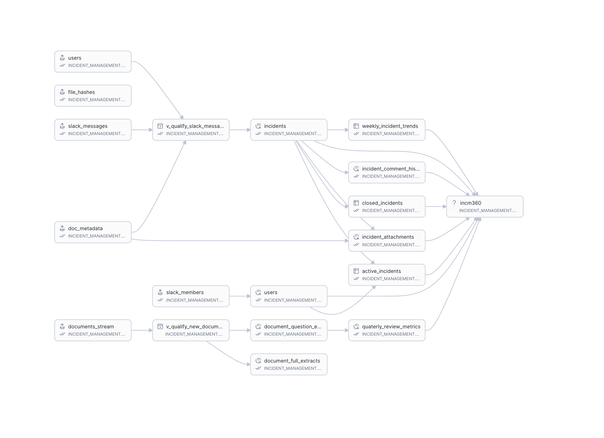

= Architecture Documentation
:toc:
:toc-placement!:

This document describes the technical architecture, data models, and project structure of the project.

toc::[]

== Overview

This unified data stack uses incident management as an example use-case relatable to its real-world business process, which may include registering new incidents, assessing their categories for prioritization, tracking their resolution time, etc., for KPI tracking and reporting, but also may include looking at policy documents and other review reports to answer questions and provide insights to the team.

The idea is to showcase how teams can now bring in multi-modal data into Snowflake with ease and create a more rounded, 360-degree view of the entire business process. 

== System Architecture

The platform follows a modern data stack architecture built entirely on Snowflake:

=== Components

. Sources

.. Slack App

* User-facing interface for incident reporting from Slack channels where a bot is deployed to capture the incident details and attachments
* This bot is connected to an OpenFlow connector to ingest the data into Snowflake
* Supports text messages and image attachments

... OpenFlow Slack Connector

* Real-time data ingestion from Slack (seconds latency)
* Automatic message and file capture
* Stores raw data in Bronze Zone tables

.. Unstructured Documents

* Snowflake Staged of unstructured documents like PDFs, Word documents, etc.
* 2 primary sub-directories:
** _full_ - for full documents that are not expected to be split into chunks
** _qa_ - for documents that are expected to be split into chunks for question and answer extraction
* These documents are queried through a View in Bronze Zone to qualify the documents for processing

. Transformation (dbt Projects)

+
Business logic implementation using Standard models, Semantic Views, Cortex Search, and Cortex Agents. 
Layered approach to processing data from Bronze to Gold Zone. 
AI-powered classification and enrichment using AISQL within dbt models
AI-powered text chunk extraction from documents for search and retrieval, with deployment of Cortex Search service.
AI-powered question extraction from documents for answer retrieval, using dbt Model _meta_ config.
Semantic View creation using the link:https://hub.getdbt.com/Snowflake-Labs/dbt_semantic_view/latest/[latest Snowflake Semantic View dbt package]
+

.. Bronze Zone (Raw Data)

* Landing zone for raw Slack data, Slack attachments, and for raw document data from sources like Google Drive, Box, etc. (This project doesn't showcase OpenFlow connectors for document ingestion, but it is possible to use them for document ingestion.)
* Minimal transformations like file type detection, file size validation, etc.
* Source of truth for all incidents and attachments, and other raw unstructured documents that may be relevant to the entire incident management process

.. Silver Zone (Processed Data)

* link:docs_processing.adoc[Unstructured documents processing] that may be useful for a 360-degree insights into incident management processes, policies, etc.
* Two primary mechanisms for processing unstructured documents:
+
** Text chunk extraction for search and retrieval. This is used to create link:cortex_search.adoc[Cortex Search] service for hybrid search on large bodies of text from documents of such nature
** Question extraction for answer retrieval. Extracted question and answer pairs are stored in a table in Silver Zone later used in Semantic View for this project.

.. Gold Zone (Analytics-Ready)

* Consumption-ready data models for incidents (open, closed, weekly metrics, quarterly business metrics, etc.)
* link:cortex_agent.adoc[Cortex Agent] with access to the Semantic View and the Cortex Search service for use with Snowflake Intelligence

.. Semantic Views (Semantic Views)

* link:semantic_view.adoc[Semantic Views] created from *all* the processed and conformed (structured) data in Gold Zone for Text2SQL analysis through Cortex Analyst

. Consumption (Snowflake Intelligence)

* Snowflake Intelligence for interactive analysis through Cortex Agent and Semantic View deployed previously.
* Additionally (and optionally) a Streamlit dashboard can be deployed to visualize the incidents and their statuses as a more traditional method of reporting pre-calculated metrics and insights.

=== dbt DAG

[NOTE]
====
dbt Projects allows to view this DAG from within Workspace > Projects > dbt Projects.

Or, from Horizon Catalog > Database Explorer > Incident Management > dbt Projects > Project Details
====

=== Quick Links for dbt Models for document processing

[cols="1,2"]
|===
|dbt Projects Component |Documentation

|link:docs_processing.adoc[*Document Processing*]
|Unstructured document processing for text and question extraction

|link:cortex_search.adoc[*Cortex Search*]
|Hybrid search service for document retrieval

|link:semantic_view.adoc[*Semantic Views*]
|Semantic layer for Text2SQL analysis

|link:cortex_agent.adoc[*Cortex Agents*]
|AI agents with access to Semantic Views and Cortex Search

|===

'''

link:../README.adoc[← To README] ||| link:SETUP.adoc[→ To Setup Guide]

'''

