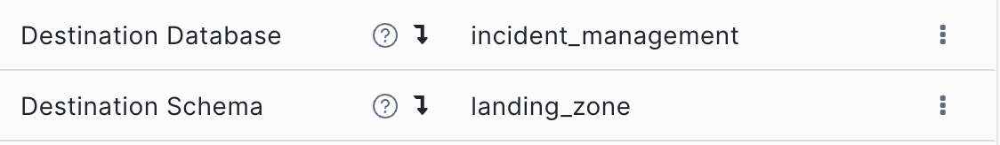
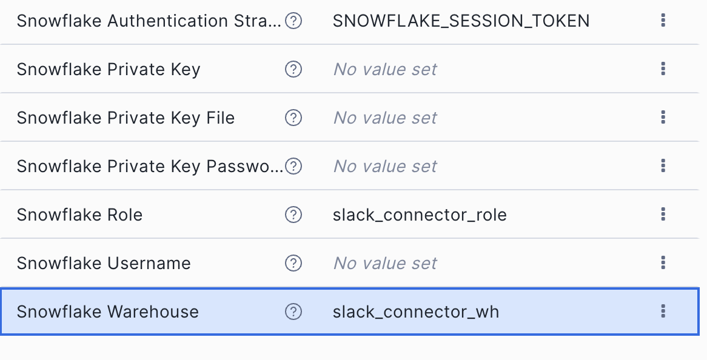

= Installation & Setup Guide
:toc:
:toc-placement!:
// Document attributes and variables
:repo-url: https://github.com/Snowflake-Labs/unified-data-stack-for-incident-management.git
:repo-name: unified-data-stack-for-incident-management
:env-file: .env
:env-template: .env.template
:snowflake-config: ~/.snowflake/config.toml
:conn-placeholder: your-connection-name
:repo-placeholder: your-repository-url
:default-database: incident_management
:default-schema: dbt_project_deployments
:model-schema: bronze_zone
:gold-schema: gold_zone
:default-warehouse: demo_wh
:default-role: dbt_projects_engineer
:streamlit-env-var: STREAMLIT_DEPLOYMENT_ENABLED

This guide walks you through setting up the unified data stack on Snowflake.

toc::[]

== Prerequisites

Before starting the installation, ensure you have:

* *Snowflake CLI* installed (link:https://docs.snowflake.com/en/developer-guide/snowflake-cli/installation/installation[installation guide])
* *Snowflake connection* configured in `{snowflake-config}`
* *ACCOUNTADMIN privileges* in your Snowflake account
* *Git* installed on your local machine
* *OpenFlow SPCS* deployment and runtime. Use these link:https://docs.snowflake.com/en/user-guide/data-integration/openflow/setup-openflow-spcs[installation instructions] to set up OpenFlow SPCS within your Snowflake account

== Key Directories

* *`data/`*: Sample and seed data for testing and initial setup
* *`docs/`*: Sample documents for text extraction and question extraction.
* *`src/incident_management/`*: Core dbt project with data models
* *`src/sql/`*: Infrastructure setup and raw SQL scripts
* *`src/streamlit/`*: Interactive dashboard application
* *`python_scripts/`*: Utility scripts for reporting and automation

== Installation Steps

This project demonstrates dbt Projects deployment and execution from a local dev machine. Once deployed, you can switch to Snowflake Workspaces to manage further redeployments and test executions.

. Fork and Clone the Repository
+
[source,bash,subs="attributes+"]
----
git clone {repo-url}

cd {repo-name}

git remote add upstream <{repo-placeholder}>

git remote -v
----

. Configure Environment Variables
+
Copy the template and configure your environment:
+
[source,bash,subs="attributes+"]
----
cp {env-template} {env-file}
----
+
[NOTE]
====
If you change any of the below parameters, be sure to change the `profiles.yml` as well before running the Makefile:

** `DBT_PROJECT_DATABASE={default-database}`
** `DBT_PROJECT_SCHEMA={default-schema}`
** `MODEL_SCHEMA={model-schema}`
** `DBT_PIPELINE_WH={default-warehouse}`
** `DBT_PROJECT_ADMIN_ROLE={default-role}`
====
+
Edit the `{env-file}` file and configure all variables except this one (generated later):
+
** `DBT_SNOWFLAKE_PASSWORD`

. Setup Snowflake Infrastructure
+
Use the Makefile to automate the entire Snowflake setup.
+
[NOTE]
====
Replace `<{conn-placeholder}>` with the connection name defined in your `{snowflake-config}`
====
+
[IMPORTANT]
====
Role setup commands require ACCOUNTADMIN privileges
====
+
.. Option A: Complete Setup (Recommended)
+
[source,bash,subs="attributes+"]
----
# Run complete installation
make install ENV_FILE={env-file} CONN=<{conn-placeholder}>
----

.. Option B: Step-by-Step Setup
+
For detailed information about available Makefile targets:
+
[source,bash]
----
make help
----
+
Run each step individually:
+
[source,bash,subs="attributes+"]
----
# Step 1: Generate snowflake.yml configuration
make generate-yaml ENV_FILE={env-file}

# Step 2: Setup dbt Projects infrastructure
make setup-dbt-stack CONN=<{conn-placeholder}>

# Step 3: Setup Slack connector infrastructure
make setup-slack-connector CONN=<{conn-placeholder}>

# Step 4: Setup Snowflake tasks
make setup-tasks CONN=<{conn-placeholder}>

# Step 5: Setup procedures and functions
make setup-procs-funcs CONN=<{conn-placeholder}>

# Step 6: Deploy Streamlit app (optional, requires {streamlit-env-var}=true)
{streamlit-env-var}=true make deploy-streamlit CONN=<{conn-placeholder}>
----
+
[NOTE]
====
The Streamlit deployment step is optional and will only proceed if `{streamlit-env-var}` is set to `true`. If the environment variable is not set or set to any other value, the deployment will be skipped with a warning message.
====

. Slack Connector Configuration
+
After running the Makefile setup, configure the Slack connector in your OpenFlow SPCS runtime.

.. Review Prerequisites
+
Check the link:https://docs.snowflake.com/en/user-guide/data-integration/openflow/connectors/slack/setup#prerequisites[pre-requisites] for the Slack connector.

.. Create Slack App
+
Create a Slack app in your workspace using the given link:https://docs.snowflake.com/en/user-guide/data-integration/openflow/connectors/slack/setup#set-up-a-slack-app[manifest].

.. Generate App Token
+
While creating your Slack app, ensure to generate the App token using at least the below scope:
+
* `connections:write`

.. Update External Access in Snowflake
+
Update the link:https://docs.snowflake.com/en/user-guide/data-integration/openflow/connectors/slack/setup#setup-necessary-ingress-rules[External Access Integration] object to add `slack.com` domain for egress from SPCS containers.

.. Configure Connector in OpenFlow Runtime Canvas
+
Use these link:https://docs.snowflake.com/en/user-guide/data-integration/openflow/connectors/slack/setup#configure-the-connector[instructions] to configure the connector. 
Ensure to use the database and role parameters created by the Makefile (values in the screenshot may change based on configuration within .env file):
+

.. Start and Test
+
Start the connector and add the Slack app to a channel. Verify these tables are created:
+
* `SLACK_MEMBERS`
* `SLACK_MEMBERS_STAGING`
* `DOC_METADATA`
* `FILE_HASHES`
* `SLACK_MESSAGES`

. Test Message and Document Ingestion
+
Drop a test message in your Slack channel and verify that a record appears in the `SLACK_MESSAGES` table (might take a few seconds).
+
Drop a test documents (PDFs, Word documents, etc.) in the bronze_zone.DOCUMENTS under _full_ and _qa_ sub-directories each.

. Creating the data models and Cortex AI services
+
Manually execute the Tasks available in the following order to build the baseline models and the Cortex AI services on top including the Cortex Agent:
+
* `incm_root_daily_incremental_refresh`
* `incm_root_triggered_docs_processing`
* `incm_root_deploy_cortex_services`
+

. Snowflake Intelligence
+
Once Cortex Agent has been created follow instructions link:https://docs.snowflake.com/en/user-guide/snowflake-cortex/snowflake-intelligence#add-agents[here] to add the Cortex Agent to Snowflake Intelligence.

. Streamlit Dashboard (Optional)
+
Optionally, you can deploy a Streamlit dashboard to visualize the incidents and their statuses as a more traditional method of reporting pre-calculated metrics and insights.
+
Deploying the Streamlit dashboard is controlled by an environment variable in the `{env-file}` file called `{streamlit-env-var}`. Set it to `true` to deploy the Streamlit dashboard when you run the Makefile install command.
+
[NOTE]
====
If using Option A (Complete Setup), the Streamlit app will be deployed automatically if `{streamlit-env-var}=true` is set in your `{env-file}` file. If using Option B (Step-by-Step), refer to Step 6 in the commands above.
====

.. Accessing the Dashboard
+
After completing the setup, a Streamlit in Snowflake (SiS) app will be deployed to your Snowflake account. This enables you to run through foundational scenarios end-to-end.

.. Dashboard Features
+
* *Metrics Overview*: Critical, high-priority, active, and recently closed incident counts
* *Active Incidents Table*: Real-time view of open incidents with priority indicators
* *Recently Closed Incidents*: Track resolution times and outcomes
* *Attachment Viewer*: Click on incidents with attachments to view images
* *Trend Analysis*: Monthly and weekly incident patterns (when data is available)

'''

link:../README.adoc[← To README] ||| link:DEMOS.adoc[→ To Demo Vignettes]

'''
